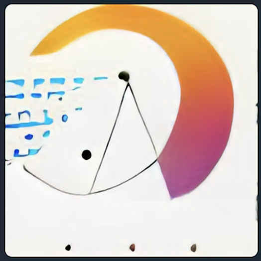
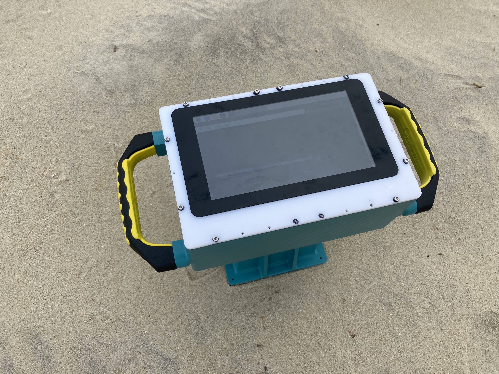
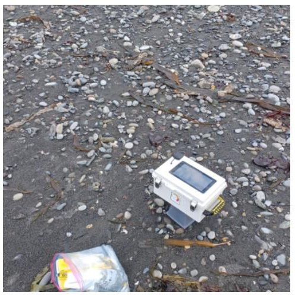
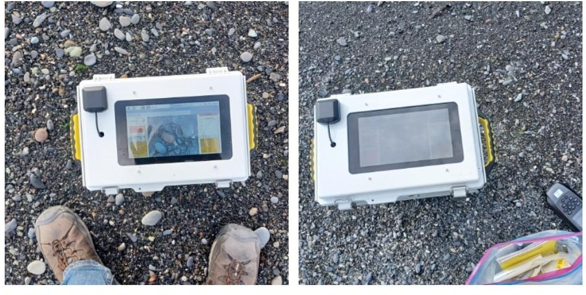
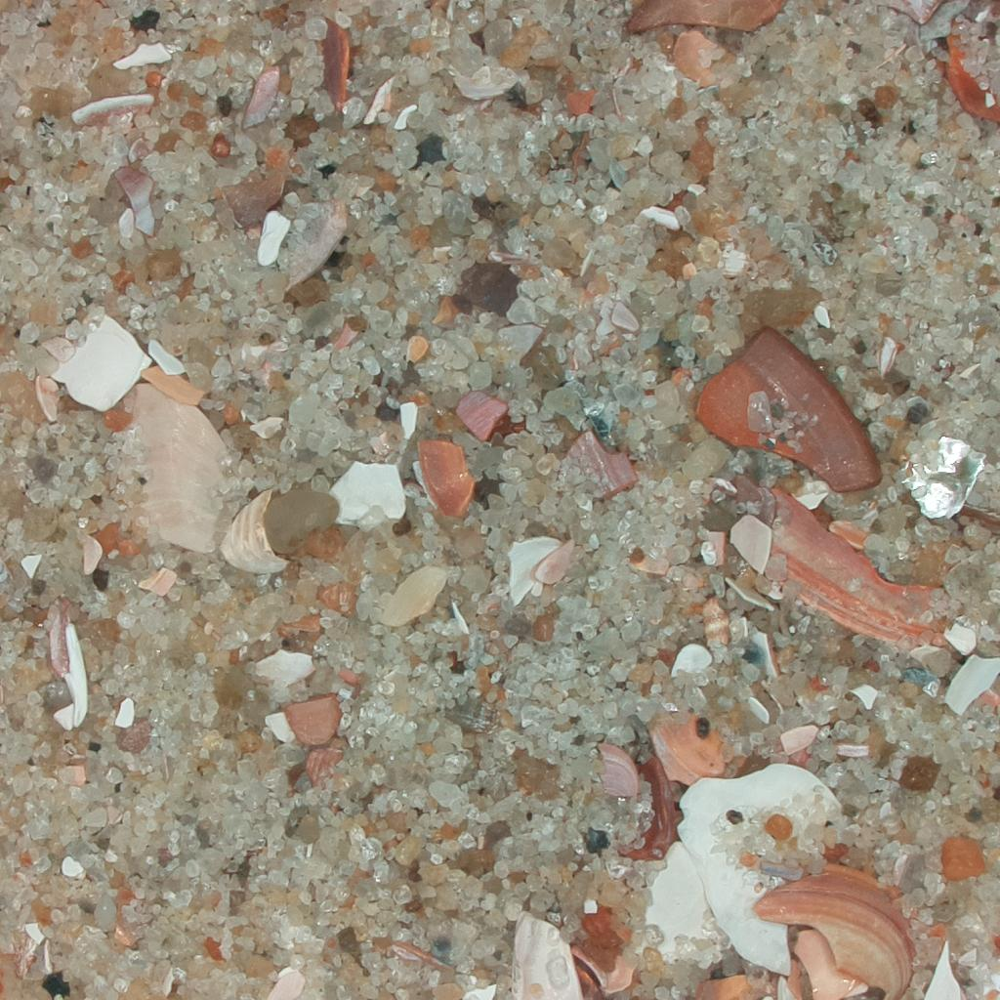

# Instagrain

A camera for measuring sediment grain size in the field - 'instant grainification' (h/t D. Rubin et al., 2007)
The camera currently runs a deep learning model to estimate grain size from pictures (using tensorflow lite)

We have several working prototypes out in the field. Here at HQ we continue to refine the camera design, hardware, software, and ML model. 

Prototpye 1 (3D printed case)

Prototype 2 (current version; CNC'ed case and 3D printed parts)

## To Build the Camera:

0. Get in touch with us, we would be happy to collaborate!

1. Read through the repository.

2. Hardware: Follow the instructions in the [hardware readme](./hardware/readme.md) to 3D print the case with an SLA or SLS printer. Wire the electronic components. Assemble the camera.

3. Software: Follow the instructions in the [software readme](./software/readme.md) to load the Raspberry Pi with the neccesary programs.

4. Test the camera. We recommend taking a picture of sand with known grain size characteristics.

## Code of Conduct

We intend to foster an inclusive and respectful environment surrounding the contribution and discussion of our project. Make sure you understand our [Code of Conduct](./CODE_OF_CONDUCT.md).

