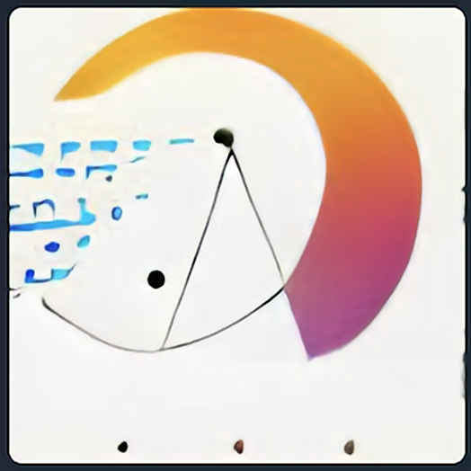
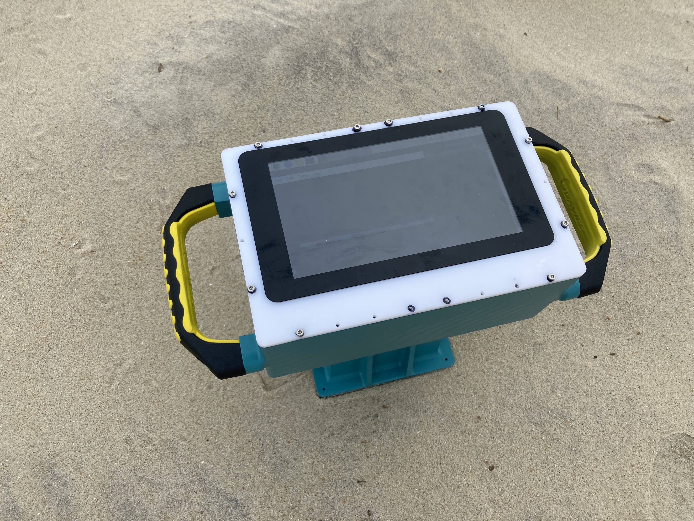
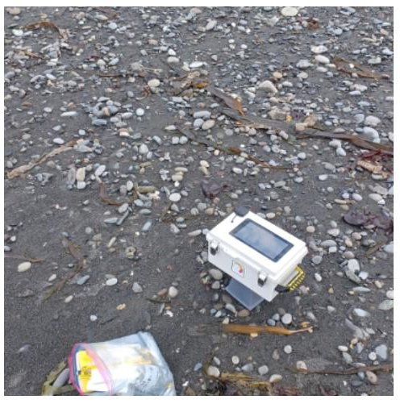
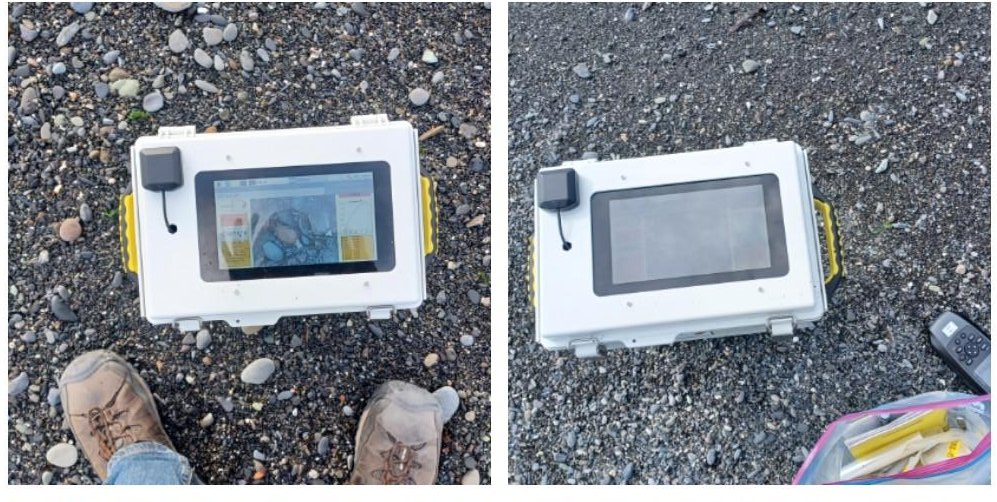

# Instagrain

A camera for measuring sediment grain size in the field - ['instant grainification'](https://ui.adsabs.harvard.edu/abs/2007AGUFM.H51I0899R/abstract) (h/t Rubin & Chezar, 2007)
The camera currently runs a deep learning model to estimate grain size from pictures (using tensorflow lite)

We have several working prototypes out in the field. Here at HQ we continue to refine the camera design, hardware, software, and ML model. 

Prototype 1 (3D printed case)

Prototype 2 (current version; CNC'ed case and 3D printed parts)

## Do you want to be involved?:

0. Get in touch with us, we would be happy to collaborate!

1. Check out our [wiki](https://github.com/UNCG-DAISY/Instagrain/wiki) to learn how to build and use the camera.  

2. Read through the repository to look at the files/code we provide.

3. Check out the open [issues](https://github.com/UNCG-DAISY/Instagrain/issues) and participate in our [discussion](https://github.com/UNCG-DAISY/Instagrain/discussions). 

## Code of Conduct:

We intend to foster an inclusive and respectful environment surrounding the contribution and discussion of our project. Make sure you understand our [Code of Conduct](./CODE_OF_CONDUCT.md).

